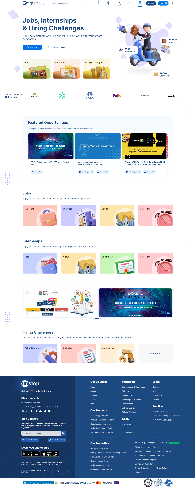

# Unstop UI clone

<h3>Description :</h3> 
This is a simple clone of few pages from unstop website.

👉[Click here](https://unstop-clone.netlify.app/) to check out the clone.
 

### Home page

 

### Practice page

 

### Jobs page

### Tools and technologies used :

 

### Connect with me :

